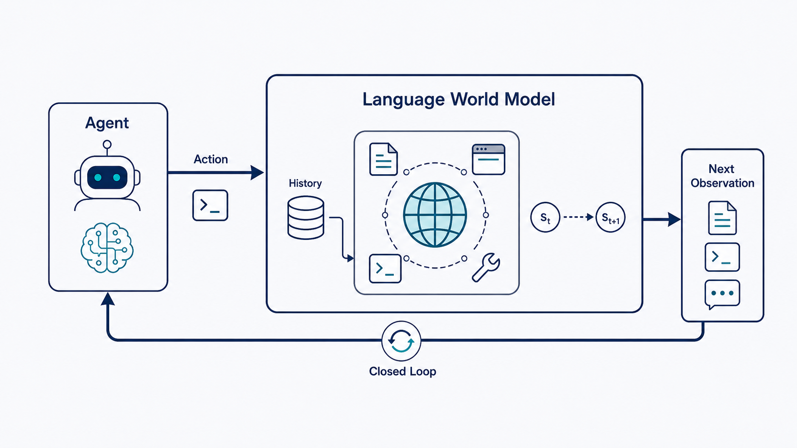
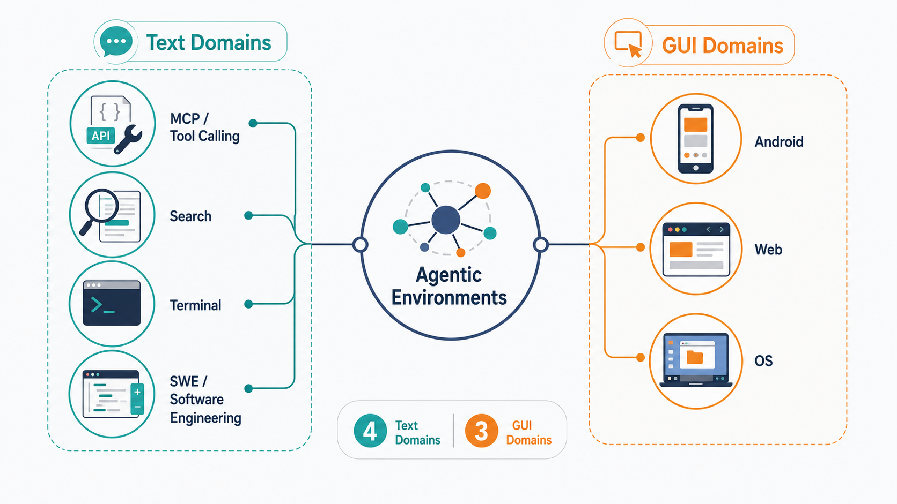
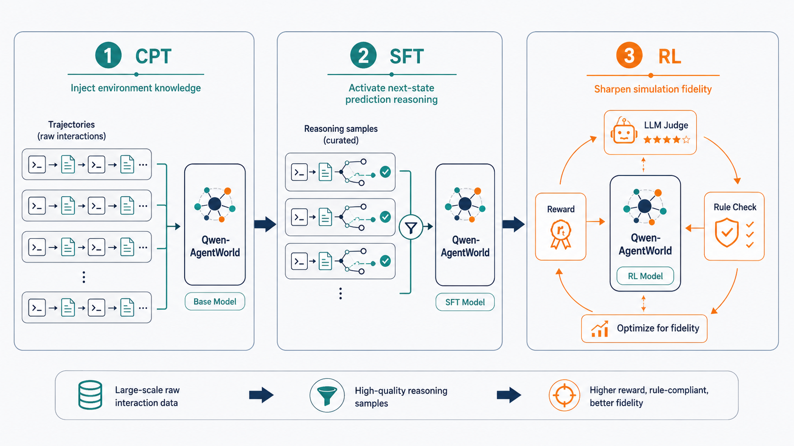
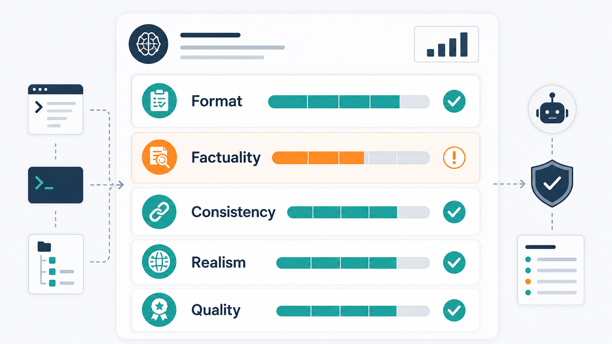
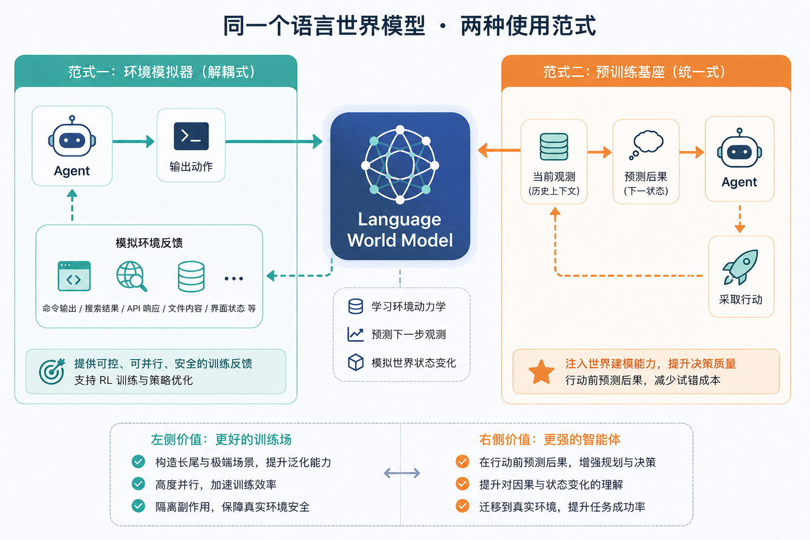

# Qwen-AgentWorld：让模型扮演环境

> 本文基于 Qwen 团队发布的论文《Qwen-AgentWorld: Language World Models for General Agents》整理。

让 Agent 直接在真实环境里学做事，有点像让新手司机第一天就练急刹、并线和倒车入库：你练得确实很真实，但副驾的教练也确实有点胆战心惊。

换成 Agent，就是让它真跑命令、真点网页、真调 API、真改文件。一次错误可能只是拿到报错，也可能污染环境、发出真实请求，甚至删掉不该删的东西。可强化学习偏偏需要模型反复试错。

Qwen-AgentWorld 的切入点就是：别急着让 Agent 在真实世界里摔跤，先训练一个大模型来**扮演环境本身**。Agent 做出动作，它不真的进入终端、浏览器、工具或操作系统，而是由这个语言世界模型预测环境下一步会返回什么。

它要补上的，不是一个更会办事的 Agent，而是一个便宜、可控、可并行的学习型训练场。


<p align="center"><em>图 1：语言世界模型不预测“下一步该怎么做”，而预测“做完这一步后，环境会返回什么”</em></p>

## 一、Agent 最缺的不是大脑，是安全试错场

用模拟环境替代真实环境训练，并不是新鲜事。自动驾驶会在仿真里反复练暴雨、急刹、遮挡和罕见险情；机器人会先在物理模拟器里练动作；游戏智能体也会在可重复的环境里跑数以亿计的回合。

Agent 训练遇到的是同一个问题，只是环境从物理世界换成了语言和软件世界。

一个 Coding Agent 的“世界”可能是代码仓库、终端、测试框架、依赖管理器；一个 Web Agent 的“世界”可能是 DOM、无障碍树、按钮状态和浏览器历史；一个 Tool Agent 的“世界”则可能是数据库、文件系统、API 和工具返回值。

如果每一次试错都要访问真实环境，训练会被三类问题卡住：

- **规模问题**：真实终端、浏览器、沙箱、GUI 虚拟机都很重，难以大规模并行。
- **可控问题**：真实环境返回什么很难指定，无法稳定制造“磁盘不足”“搜索只给线索”“API 限流”这类训练场景。
- **副作用问题**：真实工具调用可能写文件、发请求、改状态，很多任务不能放开让模型乱试。

所以关键问题变成：能不能训练一个模型，专门学习“环境会怎么反应”？

Qwen-AgentWorld 给出了回应：可以。这个模型就叫 **Language World Model（语言世界模型，LWM）**。

## 二、Qwen-AgentWorld 到底预测什么？

普通 Agent 学的是策略：看到当前状态，决定下一步动作。语言世界模型学的是环境动力学：看到历史观测和当前动作，预测下一步观测。

更形式化地说，它学习的是：

$$
p(o_{t+1} \mid o_{\le t}, a_t)
$$

也就是：给定过去看到的一切 $o_{\le t}$，以及当前动作 $a_t$，环境下一步会返回什么 $o_{t+1}$。

可以把二者放在一张表里看：

| 角色 | 输入 | 输出 | 学到的东西 |
|---|---|---|---|
| Agent / Policy | 当前观测 | 下一步动作 | “我该做什么” |
| World Model | 历史观测 + 当前动作 | 下一步观测 | “世界会怎么回应” |

这个方向差异很重要。Qwen-AgentWorld 不是一个更会操作工具的 Agent，而是一个给 Agent 提供训练反馈的“环境代理”。它像考官，不是考生；像训练场，不是运动员。

“世界模型”本身也不是 Qwen-AgentWorld 首创。这个概念可以追溯到模型化强化学习里的 Dyna，后来 Ha 与 Schmidhuber 的《World Models》让这个术语在深度学习语境中流行起来；LeCun 的 JEPA 则强调在抽象表示空间而非像素空间做预测。到语言模型时代，Hao 等人的 RAP 明确提出让 LLM 兼任世界模型与推理体。

Qwen-AgentWorld 的贡献不在“第一次提出这个想法”，而在把它**工程化、规模化、基准化**：覆盖 7 类 Agent 交互领域，使用超过 1000 万条真实环境交互轨迹训练，论文介绍 35B-A3B 与 397B-A17B 两个 MoE 模型，并构建 AgentWorldBench 来评估世界建模质量。

先看几个关键口径：

| 事实 | 口径 |
|---|---|
| 交互领域 | 7 类：MCP、Search、Terminal、SWE、Android、Web、OS |
| 训练数据 | 论文称使用超过 1000 万条真实环境交互轨迹 |
| 论文模型 | Qwen-AgentWorld-35B-A3B 与 Qwen-AgentWorld-397B-A17B |
| 评测集 | AgentWorldBench，2,170 条评测样本 |
| 主结果 | 论文/官方仓库报告 397B-A17B 总分 58.71，高于 GPT-5.4 的 58.25；35B-A3B 总分 56.39，高于 Claude Sonnet 4.6 的 56.04 |
| 开源状态 | 截至 2026-06-28，官方仓库明确开放 35B-A3B 权重与 AgentWorldBench |

这里尤其要注意措辞：这些结果是**在 AgentWorldBench 这个基准上的论文报告结果**，不能外推成“所有 Agent 任务全面领先”。

## 三、这个“世界”包含什么：7 类交互域

世界模型要预测“环境返回什么”，首先要定义环境。Qwen-AgentWorld 把 Agent 常见的交互环境统一成 7 类，并用统一的“动作 - 观测”轨迹表示。

| 领域 | 场景 | Agent 的动作 | 环境的观测 | 类别 |
|---|---|---|---|---|
| MCP | 标准化工具调用 | JSON 工具调用 | 文件、数据库、API 等工具响应 | 文本域 |
| Search | 联网检索 | 检索 / 网页抽取 | 搜索结果、网页内容、对话历史 | 文本域 |
| Terminal | 命令行 | Bash 命令 / 按键 | stdout、stderr、shell 提示符 | 文本域 |
| SWE | 软件工程 | 读文件 / 改代码 / 执行命令 | 工具输出、文件内容、代码 diff | 文本域 |
| Android | 移动端操作 | 触控 / 滑动 / 输入 | UI 视图层级、应用状态 | GUI 域 |
| Web | 浏览器操作 | 点击 / 输入 / 导航 | 无障碍树、浏览器状态 | GUI 域 |
| OS | 桌面系统操作 | 鼠标 / 键盘 | 无障碍树、窗口与应用状态 | GUI 域 |

这张表里最值得注意的是 GUI 三域：Android、Web、OS。它们不让模型预测屏幕像素，而是预测**结构化界面状态**，例如无障碍树、视图层级、窗口状态。

这不是偷懒，而是很务实的选择。

Agent 真正用来决策的，通常不是“屏幕上每个像素是什么颜色”，而是“这里有没有按钮”“按钮叫什么”“当前输入框是否可编辑”“点击之后 DOM 或窗口状态会如何变化”。对 Web 来说，DOM 是浏览器解析 HTML 后得到的元素树；无障碍树则是更语义化的界面结构，保留角色、名称、状态等 Agent 更需要的信息。

所以 Qwen-AgentWorld 没有把 GUI 世界建模成一张图片，而是建模成 Agent 能读懂、也更适合做决策的结构化状态。这与 LeCun 反复强调的“不要浪费算力生成像素”是同一条思路。


<p align="center"><em>图 2：七类交互域可以分成文本域与 GUI 域，GUI 域预测的是界面结构，而不是像素截图</em></p>

## 四、三阶段训练：先看世界，再解释世界，最后像世界

Qwen-AgentWorld 的训练配方可以概括为三句话：

1. **CPT 让模型见过世界。**
2. **SFT 让模型学会解释世界。**
3. **RL 让模型生成得更像真实世界。**

论文用一个 Terminal 例子解释这条路线：执行 `pip install torch`，但环境里是 CUDA 11.8，且磁盘只剩 2 GB。真实终端大概率会在解包阶段因为空间不足失败。一个合格的世界模型，不只是要知道会失败，还要生成像真实终端一样的错误文本。

| 阶段 | 目标 | 数据形态 | 关键机制 |
|---|---|---|---|
| CPT | 注入环境知识 | 非思维轨迹：只有动作与观测 | 轮次级信息论损失掩码 |
| SFT | 激活显式推理 | 高质量思维轨迹 | 拒绝采样，10,250 条候选查询筛到 7,094 条 |
| RL | 锐化模拟保真度 | 生成结果接受评分与规则校验 | GSPO + rubric / rule 混合奖励 |

### 4.1 CPT：先学“世界长什么样”

继续预训练（CPT）阶段使用的是大量真实环境交互轨迹。它们是“非思维轨迹”：只有动作和观测，不包含解释过程。

例如：

```text
Action: ls -la
Observation: total 24
...
```

这个阶段不要求模型解释为什么会这样，只要求它见过足够多“做了什么 - 随后出现什么结果”的配对。就像新人进项目，先看大量真实工单、日志、命令输出和 diff，建立对系统行为的直觉。

但这里有一个训练细节很关键：多轮轨迹里并不是每一轮都值得学。

有些观测只是把动作回显了一遍，有些输出是固定模板，有些命令没有产生任何新信息。如果这些轮次也同等计入损失，模型会浪费算力学习“复读”。所以论文设计了**轮次级信息论损失掩码**，用几个表层统计量判断一轮观测到底有没有信息量：

| 指标 | 问题 |
|---|---|
| Overlap | 观测里有多少词只是从动作里抄来的 |
| Novelty | 观测里有多少是真正新增的信息 |
| Jaccard | 动作与观测的词集有多相似 |
| Length ratio | 观测相对动作长了多少 |

论文据此把轮次分成不同类型：例如 retrieval 类信息量高，完整计入损失；echo 类基本只是回显，只有少量保留。被掩码的轮仍然作为上下文存在，只是不参与学习。

这一步看似工程化，实际很重要：它让训练算力集中在真正承载状态变化的地方。

### 4.2 SFT：再学“为什么会这样”

监督微调（SFT）阶段开始加入显式推理。模型不再只是直接吐出下一步观测，而是在生成观测前先做推断。

还是 `pip install torch` 的例子。一个更强的世界模型会先判断：CUDA 版本、磁盘容量、依赖体积、安装过程的解包阶段之间存在因果关系；然后再输出“磁盘空间不足”的终端报错。

这个阶段的数据不是随便生成的。论文采用拒绝采样：从 10,250 条候选查询出发，每条生成 3 条候选思维轨迹，再由独立评委打分，只保留最优且过阈值的样本，最终得到 7,094 条，高质量样本保留率为 69.2%。

这里的“拒绝采样”不要理解成统计学教材里严格的采样算法。放在这篇论文语境里，它更接近数据构造中的“广泛生成、严格筛选、留下好样本、丢掉差样本”。

### 4.3 RL：最后把输出打磨到像真的

强化学习（RL）阶段的目标是模拟保真度。模型不仅要答对，还要像真实环境一样答。

论文采用 GSPO，并用两类奖励混合：

- **rubric 评分**：Format、Factuality、Consistency、Realism、Quality 五个维度，由 LLM 评委打分。
- **规则验证**：检查格式、schema、特定领域约束等可程序化验证的部分。

二者按 9:1 加权。这个设计说明了一点：世界建模不只是开放式文本生成，它必须同时满足“像人判断的真实”和“像系统校验的正确”。

论文还专门处理了几类训练失效：多轮展开导致奖励崩溃、开放式 rubric 被模型钻空子、自夸式表述抬高得分。换句话说，它不只是让模型学会模拟环境，还要防止模型学会“骗评分器”。


<p align="center"><em>图 3：CPT 注入环境知识，SFT 激活下一状态预测推理，RL 锐化模拟保真度</em></p>

## 五、涌现推理：环境模拟不只是“补全文本”

一个常见误解是：世界模型只是“补全下一段文本”。如果只是补全，确实没什么新鲜。但 Agent 环境里的下一步观测，往往不是表面文本的顺滑延续，而是隐藏状态变化后的结果。

执行一个命令后，文件系统状态可能变了；改了一段代码后，测试失败点可能变了；点击一个按钮后，DOM 和无障碍树可能变了；搜索环境还可能要“给线索，但不能泄露答案”。要预测这些结果，模型必须在内部追踪因果链。

这也是 Qwen-AgentWorld 最有意思的地方：它的训练目标并没有直接要求模型“展示某种固定推理套路”，但在高保真预测下一观测的压力下，模型出现了几类可观察的**涌现推理模式**。官方博客分析了四个文本类领域的 129 条思维链，归纳出三种典型行为。

**第一，自我修正。** 模型会用 `Wait!` 作为中途纠错信号，打断并修正自己的中间预测。博客统计，在 129 个轮次里出现了 1,347 次这类中断，平均每 turn 10.4 次。它修正的内容不只是措辞，还包括事实错误、知识边界，以及“我不能真的执行 `np.random.seed(42)`”这类视角切换。

**第二，信息泄漏防护。** 在 Search 领域，世界模型有时知道参考答案，但它要模拟的是“搜索环境会返回什么”，不是直接把答案塞给 Agent。当查询与目标答案无关时，模型会约束摘要，避免无意中泄露目标。这有点像世界模型版本的 **theory of mind**：它不仅要知道答案，还要知道“当前环境不该让智能体知道答案”。

**第三，多步因果推理。** 例如预测 `curl -s localhost:3000 | python3 -m json.tool` 的输出，不能只看命令表面。模型需要串起一条因果链：Node.js 缺失，服务器没有启动，3000 端口没有监听，`curl` 静默失败，空输出被管道传给 `json.tool`，最后抛出 `JSONDecodeError`。这类推理更接近“模拟系统状态”，而不是语言层面的顺滑续写。

这里的关键不是把“涌现”说得玄，而是看到训练目标的变化：当模型要预测环境反馈，而不是回答用户问题时，它被迫学习命令、代码、工具、网页状态之间的隐含因果关系。

论文还给出一个很值得记下的现象：**Factuality（事实性）始终是最弱维度**。即便经过 RL，事实性相对提升最大，仍然是最难的一项。

这说明世界建模真正难的地方不是格式，也不是话术，而是“世界知识是否真的对”。对于 Search、MCP、SWE 这类强依赖事实和状态的场景，这会直接决定模拟器能不能用于严肃训练。


<p align="center"><em>图 4：AgentWorldBench 用五维 rubric 评估世界模型生成的环境观测，事实性是最需要谨慎看待的维度</em></p>

## 六、怎么用：给 Agent 练习场，或给 Agent 打底座

Qwen-AgentWorld 的用途可以分成两条路。

| 路径 | 做法 | 价值 |
|---|---|---|
| 解耦式环境模拟器 | Agent 与世界模型分开，世界模型负责返回环境反馈 | 提升 RL 训练的规模、可控性和长尾覆盖 |
| 统一式智能体基座 | 先用世界建模训练给 Agent 预热 | 让 Agent 在行动前更会预测后果 |

第一条路更像训练场。你可以用模拟指令控制环境状态，让模型返回指定类型的反馈。论文里的例子包括：

- Search 域：构造包含目标查询、参考答案和“不泄露答案”约束的模拟指令，让环境只给线索，不直接给答案。
- Terminal 域：指定 CUDA 11.8 和 2 GB 剩余磁盘，让模型预测安装依赖时的失败反馈。
- MCP 域：通过环境自适应设置，让工具返回更能暴露 Agent 弱点的响应。

这种方式的价值在于“可控”。真实环境只能给什么是什么；世界模型可以被调到你想训练的状态。你想练异常处理，就制造 API 限流；想练信息不足下的搜索，就只返回部分线索；想练长尾错误，就批量制造真实环境里很少出现但很关键的失败场景。

第二条路更像打底座。世界建模训练让 Agent 先学会预测未来状态，再去做动作选择。一个能在行动前预估后果的 Agent，原则上比只会“看到状态就出动作”的 Agent 更有上限。

论文报告，这种 LWM RL warm-up 在 Terminal-Bench 2.0、SWE-Bench Verified / Pro、BFCL v4、Claw-Eval、QwenClawBench、WideSearch 等多个基准上带来一致增益。这里要注意：这不是说世界模型本身直接替代 Agent，而是说“预测世界”可以成为 Agent 能力的一种预训练底座。


<p align="center"><em>图 5：同一个语言世界模型，既能作为环境模拟器服务 RL，也能作为 Agent 的预训练基座</em></p>

## 七、别误读：Sim RL 胜出，不等于模拟器更真实

Qwen-AgentWorld 最容易被误读的一点，是“用模拟环境训练的效果超过仅用真实环境训练”。

这句话如果不加限定，很容易变成一个错误结论：模拟器比真实环境更真实。

这当然不对。就**保真度**而言，模拟器的上限就是它要模仿的真实环境。模拟器不可能比真实环境“更真”。

真正被比较的，是两种训练方式得到的策略，在同一个真实测试集上的表现：

```text
用真实环境训练出的 Agent
vs.
用可控模拟环境训练出的 Agent
```

模拟训练可能胜出，不是因为它更真实，而是因为它更适合作为训练分布：

- 它能反复制造真实环境中少见但重要的长尾场景。
- 它能把难度调到刚好暴露 Agent 弱点。
- 它能高度并行，单位时间产生更多有效训练样本。
- 它能避免真实工具调用的副作用。

自动驾驶仿真也是同理。仿真道路不比真实道路更真，但它能反复制造暴雨、遮挡、急刹和极端工况；模型在这些场景里练够了，真实路考反而更稳。

所以更严谨的说法应该是：**可控模拟环境未必更真实，但可能比真实环境更适合训练。**

这也是 Qwen-AgentWorld 最有价值的工程信号。

## 八、边界：事实性仍最难，视觉世界还不完整

这套方法很有想象力，但边界也清楚。

第一，事实性仍然是硬问题。论文自己也显示，Factuality 是最弱维度。对于 Search、MCP、SWE 这类依赖真实知识、真实状态和真实工具行为的任务，事实性错误会直接污染训练信号。一个模拟器如果经常“像真的一样错”，反而会把 Agent 带偏。

第二，GUI 域的表示仍然偏文本化。无障碍树和视图层级很适合 Agent 决策，但它们无法覆盖所有视觉信息。复杂图表、视觉布局、截图细节、动态视觉反馈，可能仍需要更强的多模态建模。

第三，评测本身依赖 LLM judge 与 rubric。AgentWorldBench 用五维评分与参考对照式评判提高了可操作性，但只要评测依赖评委模型，就需要持续关注评分偏差、奖励作弊和与真实下游任务的相关性。

第四，开源状态要分清。截至 2026-06-28，官方仓库明确开放的是 Qwen-AgentWorld-35B-A3B 权重与 AgentWorldBench；397B-A17B 的结果来自论文和官方报告。写作与复现实验时，最好把“论文报告结果”和“可下载权重”分开表述。

回到开头的问题：Agent 训练为什么需要一个模型来扮演环境？

因为真正可规模化的 Agent 训练，不只需要更强的策略模型，也需要更好的试错场。Qwen-AgentWorld 的意义，就在于把“语言模型即世界模型”从一个推理技巧，推进成可训练、可评测、可用于强化学习的基础设施。

它不只是让模型多会一个任务，而是把 Agent 训练里最昂贵、最难控、最容易出副作用的那部分，拆出来交给一个可批量调用的语言世界模型。

如果这条路走通，未来训练 Agent 的方式可能会更像训练驾驶员：先在一个可控、可重复、能制造极端情况的训练场里犯足够多的错，再回到真实世界里少犯真正昂贵的错。

## 参考来源

- Qwen Team. [Qwen-AgentWorld: Language World Models for General Agents](https://arxiv.org/abs/2606.24597), arXiv:2606.24597.
- QwenLM. [Qwen-AgentWorld 官方仓库](https://github.com/QwenLM/Qwen-AgentWorld).
- Qwen. [Qwen-AgentWorld 官方博客](https://qwen.ai/blog?id=qwen-agentworld).
- Qwen. [AgentWorldBench 数据集](https://huggingface.co/datasets/Qwen/AgentWorldBench).
- Ha D., Schmidhuber J. [World Models](https://www.cl.cam.ac.uk/~ey204/teaching/ACS/R244_2022_2023/papers/ha_arXiv_2018.pdf), 2018.
- Hao S. et al. [Reasoning with Language Model is Planning with World Model](https://aclanthology.org/2023.emnlp-main.507/), EMNLP 2023.
